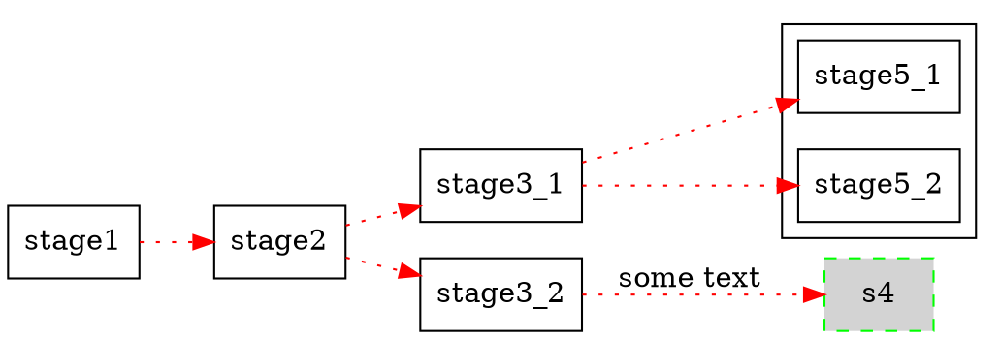

# dot(1)

[Online playground](https://edotor.net/)

## Example `dot` file to copy & paste from.

Can be rendered to `svg` with the following command.
```bash
dot -T svg -o g.svg g.dot
```

Example `dot` file.


Rendered `svg` file.


## References
- [DOT language](https://graphviz.org/doc/info/lang.html)
- [Attributes](https://graphviz.org/doc/info/attrs.html)
- [Node shapes](https://graphviz.org/doc/info/shapes.html)
- [Colors](https://graphviz.org/doc/info/colors.html)
- [User manual](https://graphviz.org/pdf/dotguide.pdf)
